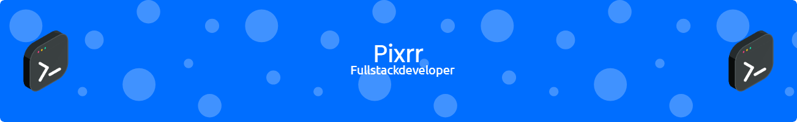

### Hi there, I'm Pixrr 👋

<!--
**pixrr/pixrr** is a ✨ _special_ ✨ repository because its `README.md` (this file) appears on your GitHub profile.

- 🌱 I’m currently learning ...
- 👯 I’m looking to collaborate on ...
- 🤔 I’m looking for help with ...
- 💬 Ask me about ...
- 📫 How to reach me: ...
- 😄 Pronouns: ...
- ⚡ Fun fact: ...

# 💻 Tech Stack:
            

-->

- 🔭 I’m currently working at **Colizey**
- 💻 My technologies: PHP, Vue, JS, Symfony and Docker
